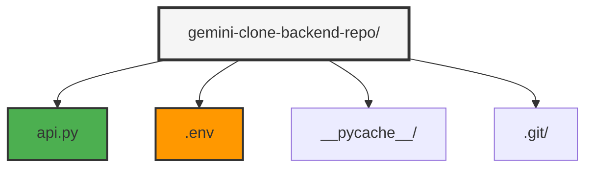
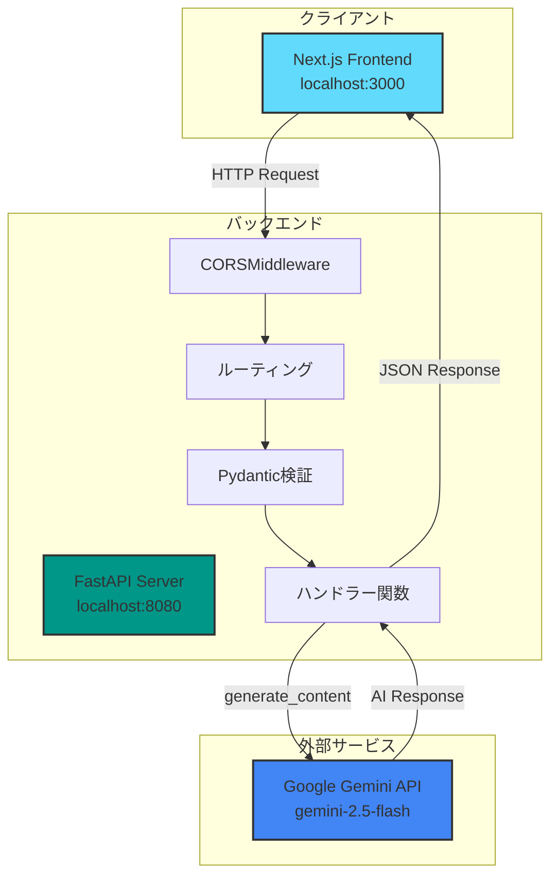
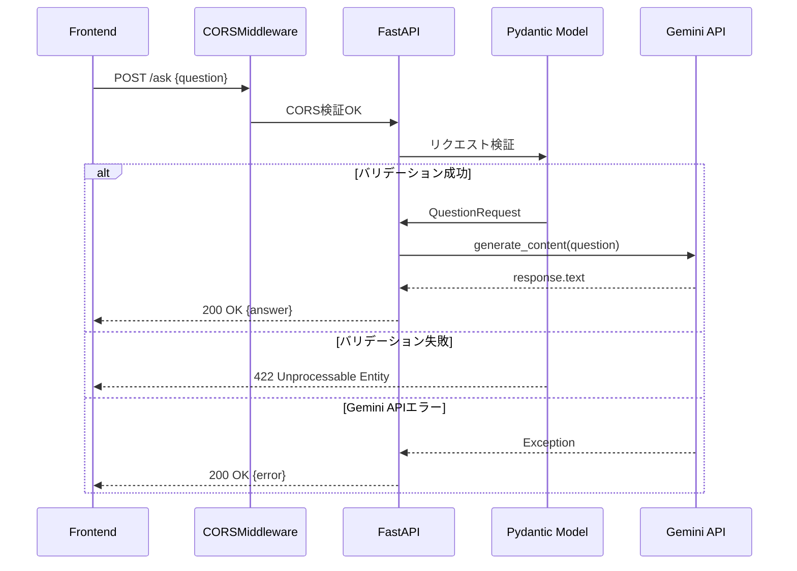
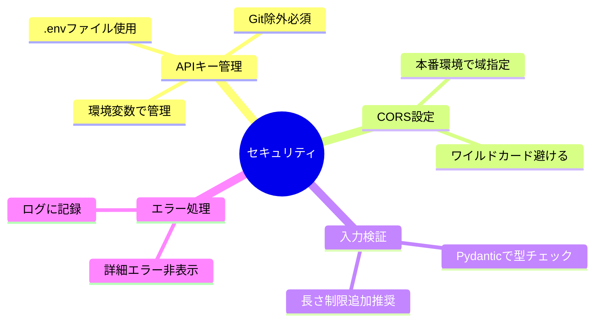
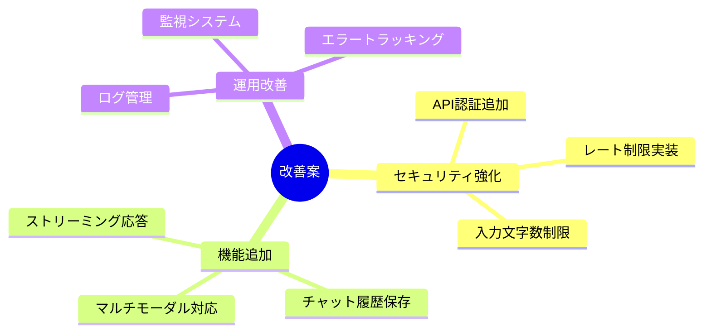

# Gemini Clone バックエンド 仕様書

## 目次
1. [プロジェクト概要](#プロジェクト概要)
2. [技術スタック](#技術スタック)
3. [ディレクトリ構造](#ディレクトリ構造)
4. [アーキテクチャ](#アーキテクチャ)
5. [APIエンドポイント](#apiエンドポイント)
6. [データモデル](#データモデル)
7. [外部API連携](#外部api連携)
8. [環境設定](#環境設定)
9. [セキュリティ](#セキュリティ)
10. [開発・デプロイ](#開発デプロイ)

---

## プロジェクト概要

**プロジェクト名**: Gemini Clone Backend

**目的**: Google Gemini AIを活用した対話型チャットアプリケーションのバックエンドAPI

**リポジトリ**: gemini-clone-backend

**主要機能**:
- FastAPIベースのREST API
- Google Gemini 2.5 Flash モデルとの連携
- CORS対応（フロントエンド向け）
- リクエストバリデーション
- エラーハンドリング

**使用AIモデル**: `gemini-2.5-flash`

---

## 技術スタック

### コアフレームワーク

| 技術 | 用途 |
|------|------|
| FastAPI | 高速なWeb APIフレームワーク |
| Uvicorn | ASGI Webサーバー |
| Pydantic | データ検証・シリアライゼーション |
| Python | プログラミング言語（3.8+推奨） |

### 外部ライブラリ

| ライブラリ | 用途 |
|-----------|------|
| google-generativeai | Google Gemini API SDK |
| python-dotenv | 環境変数管理 |

### ミドルウェア

| ミドルウェア | 用途 |
|------------|------|
| CORSMiddleware | クロスオリジンリクエスト対応 |

---

## ディレクトリ構造



### ファイル詳細

```
gemini-clone-backend-repo/
│
├── api.py                    # FastAPIアプリケーション (50行)
├── .env                      # 環境変数（APIキー）
├── __pycache__/              # Pythonキャッシュ
└── .git/                     # Gitリポジトリ
```

**主要ファイル**:
- **api.py**: FastAPIアプリケーションのメインファイル
- **.env**: Gemini APIキーを含む環境変数ファイル

---

## アーキテクチャ

### システム構成図



### リクエストフロー



---

## APIエンドポイント

### ベースURL

- **開発環境**: `http://localhost:8080`
- **ホスト**: `0.0.0.0`（すべてのネットワークインターフェース）
- **ポート**: `8080`

### エンドポイント一覧

| メソッド | パス | 説明 | 認証 |
|---------|------|------|------|
| GET | `/` | ヘルスチェック | 不要 |
| POST | `/ask` | AI質問応答 | 不要 |

---

### 1. ヘルスチェック

**エンドポイント**: `GET /`

**説明**: サーバーの稼働状態を確認

**リクエスト**: なし

**レスポンス**:
```json
{
  "message": "hello"
}
```

**ステータスコード**: `200 OK`

**実装コード**:
```python
@app.get("/")
def read_root():
    return {"message": "hello"}
```

**使用例**:
```bash
curl http://localhost:8080/
```

---

### 2. AI質問応答

**エンドポイント**: `POST /ask`

**説明**: Google Gemini AIに質問を送信し、応答を取得

**リクエスト**:
```json
{
  "question": "string"
}
```

**リクエスト例**:
```json
{
  "question": "Pythonの特徴を教えてください"
}
```

**レスポンス（成功時）**:
```json
{
  "answer": "string"
}
```

**レスポンス（エラー時）**:
```json
{
  "error": "string"
}
```

**ステータスコード**:
- `200 OK` - 正常応答（成功・エラー両方）
- `422 Unprocessable Entity` - バリデーションエラー

**実装コード**:
```python
@app.post("/ask")
async def ask_gemini(request: QuestionRequest):
    try:
        response = model.generate_content(request.question)
        return {"answer": response.text}
    except Exception as e:
        return {"error": str(e)}
```

**使用例**:
```bash
curl -X POST http://localhost:8080/ask \
  -H "Content-Type: application/json" \
  -d '{"question": "Pythonの特徴を教えてください"}'
```

**エラーケース**:

| ケース | レスポンス | ステータス |
|-------|-----------|----------|
| questionフィールド欠損 | バリデーションエラー | 422 |
| Gemini API エラー | `{"error": "..."}` | 200 |
| ネットワークエラー | `{"error": "..."}` | 200 |

---

## データモデル

### QuestionRequest

**説明**: `/ask` エンドポイントのリクエストモデル

**定義**:
```python
from pydantic import BaseModel

class QuestionRequest(BaseModel):
    question: str
```

**フィールド**:

| フィールド | 型 | 必須 | 説明 |
|-----------|-----|------|------|
| `question` | `str` | ✅ | ユーザーからの質問文 |

**バリデーション**:
- 型チェック: `str` 型であること
- 必須チェック: フィールドが存在すること

**使用例**:
```python
# 有効なリクエスト
request = QuestionRequest(question="こんにちは")

# バリデーションエラー
request = QuestionRequest()  # questionが欠損
request = QuestionRequest(question=123)  # 型が違う
```

---

## 外部API連携

### Google Gemini API

**モデル**: `gemini-2.5-flash`

**SDK**: `google-generativeai`

**初期化**:
```python
import google.generativeai as genai
from dotenv import load_dotenv
import os

# 環境変数読み込み
load_dotenv()

# API設定
api_key = os.environ.get("GEMINI_API_KEY")
genai.configure(api_key=api_key)

# モデルインスタンス作成
model = genai.GenerativeModel("models/gemini-2.5-flash")
```

**使用方法**:
```python
# テキスト生成
response = model.generate_content("質問内容")
answer = response.text
```

**エラーハンドリング**:
```python
try:
    response = model.generate_content(request.question)
    return {"answer": response.text}
except Exception as e:
    return {"error": str(e)}
```

---

## 環境設定

### 環境変数 (.env)

**.env ファイル（ローカルのみ）**:
```env
GEMINI_API_KEY=your_actual_api_key_here
```

**重要**:
- `.env`ファイルは`.gitignore`に含まれており、GitHubにはプッシュされません
- APIキーは絶対にGitにコミットしないでください

**.env.example（テンプレート）**:
```env
# Google Gemini API Key
# Get your API key from: https://aistudio.google.com/app/apikey
GEMINI_API_KEY=your_api_key_here
```

**.gitignore に含まれるファイル**:
```
# Environment variables
.env
.env.local
.env.*.local

# Python cache
__pycache__/
*.py[cod]
*$py.class

# Virtual environment
venv/
env/
```

### 環境変数の読み込み

```python
from dotenv import load_dotenv
import os

# .envファイルを読み込む
load_dotenv()

# 環境変数を取得
api_key = os.environ.get("GEMINI_API_KEY")
```

---

## セキュリティ

### CORS設定

**説明**: フロントエンド（localhost:3000）からのリクエストを許可

**設定コード**:
```python
from fastapi.middleware.cors import CORSMiddleware

app.add_middleware(
    CORSMiddleware,
    allow_origins=["http://localhost:3000"],
    allow_credentials=True,
    allow_methods=["*"],
    allow_headers=["*"],
)
```

**設定詳細**:

| パラメータ | 値 | 説明 |
|-----------|-----|------|
| `allow_origins` | `["http://localhost:3000"]` | 許可するオリジン |
| `allow_credentials` | `True` | クレデンシャル送信を許可 |
| `allow_methods` | `["*"]` | すべてのHTTPメソッドを許可 |
| `allow_headers` | `["*"]` | すべてのヘッダーを許可 |

**本番環境での推奨設定**:
```python
app.add_middleware(
    CORSMiddleware,
    allow_origins=["https://your-domain.com"],  # 本番ドメイン指定
    allow_credentials=True,
    allow_methods=["GET", "POST"],  # 必要なメソッドのみ
    allow_headers=["Content-Type"],  # 必要なヘッダーのみ
)
```

### セキュリティ上の注意点



**改善推奨事項**:
1. APIキーをシークレット管理サービスで管理
2. レート制限の実装
3. 入力文字数制限の追加
4. エラーメッセージの簡略化

---

## 開発・デプロイ

### 依存関係インストール

```bash
pip install fastapi uvicorn google-generativeai python-dotenv
```

**requirements.txt（推奨）**:
```txt
fastapi
uvicorn[standard]
google-generativeai
python-dotenv
pydantic
```

インストール:
```bash
pip install -r requirements.txt
```

### 開発サーバー起動

**セットアップ手順**:
```bash
# 1. .envファイルを作成
cp .env.example .env

# 2. .envファイルにAPIキーを設定
# エディタで .env を開き、your_api_key_here を実際のAPIキーに置き換える

# 3. 開発サーバー起動
uvicorn api:app --reload --port 8080
```

**方法1: Uvicornコマンド**
```bash
uvicorn api:app --reload --port 8080
```

**方法2: Pythonスクリプト実行**
```bash
python api.py
```

**起動オプション**:
- `--reload`: ファイル変更時に自動リロード
- `--port 8080`: ポート指定
- `--host 0.0.0.0`: すべてのネットワークインターフェースでリッスン

**アクセス**:
- API: http://localhost:8080
- ドキュメント: http://localhost:8080/docs（Swagger UI）
- ReDoc: http://localhost:8080/redoc

### 本番デプロイ

**推奨設定**:
```bash
uvicorn api:app --host 0.0.0.0 --port 8080 --workers 4
```

**Dockerデプロイ例**:
```dockerfile
FROM python:3.11-slim

WORKDIR /app

COPY requirements.txt .
RUN pip install -r requirements.txt

COPY api.py .

ENV GEMINI_API_KEY=${GEMINI_API_KEY}

CMD ["uvicorn", "api:app", "--host", "0.0.0.0", "--port", "8080"]
```

---

## API仕様書（自動生成）

FastAPIは自動的にOpenAPI仕様書を生成します。

### Swagger UI

**URL**: http://localhost:8080/docs

**機能**:
- 対話的なAPI探索
- リクエストのテスト実行
- レスポンスの確認

### ReDoc

**URL**: http://localhost:8080/redoc

**機能**:
- 読みやすいドキュメント表示
- 検索機能
- コード例の表示

---

## 実装状況

### 実装済み機能 ✅

| 機能 | 説明 |
|------|------|
| FastAPI セットアップ | 完了 |
| CORS 設定 | フロントエンド向けに設定 |
| ヘルスチェックAPI | `GET /` 実装 |
| 質問応答API | `POST /ask` 実装 |
| Pydantic バリデーション | QuestionRequest 実装 |
| Gemini API 連携 | gemini-2.5-flash 使用 |
| エラーハンドリング | try-catch 実装 |
| 環境変数管理 | dotenv 使用 |

### 未実装機能 ❌

| 機能 | 説明 |
|------|------|
| 認証・認可 | APIキー認証等なし |
| レート制限 | リクエスト制限なし |
| ログ管理 | 構造化ログ未実装 |
| データベース | データ永続化なし |
| テストコード | ユニット・統合テスト未実装 |
| 監視・メトリクス | Prometheus等なし |

---

## 今後の改善案

### 優先度：高



### 技術的改善

1. **認証・認可**
   ```python
   from fastapi.security import APIKeyHeader

   api_key_header = APIKeyHeader(name="X-API-Key")

   @app.post("/ask")
   async def ask_gemini(
       request: QuestionRequest,
       api_key: str = Depends(api_key_header)
   ):
       # API Key検証
       ...
   ```

2. **レート制限**
   ```python
   from slowapi import Limiter
   from slowapi.util import get_remote_address

   limiter = Limiter(key_func=get_remote_address)

   @app.post("/ask")
   @limiter.limit("10/minute")
   async def ask_gemini(request: QuestionRequest):
       ...
   ```

3. **構造化ログ**
   ```python
   import logging

   logging.basicConfig(
       level=logging.INFO,
       format='%(asctime)s - %(name)s - %(levelname)s - %(message)s'
   )
   logger = logging.getLogger(__name__)

   @app.post("/ask")
   async def ask_gemini(request: QuestionRequest):
       logger.info(f"Received question: {request.question}")
       ...
   ```

4. **ストリーミング応答**
   ```python
   from fastapi.responses import StreamingResponse

   @app.post("/ask/stream")
   async def ask_gemini_stream(request: QuestionRequest):
       async def generate():
           for chunk in model.generate_content_stream(request.question):
               yield chunk.text

       return StreamingResponse(generate(), media_type="text/plain")
   ```

---

## テスト

### ユニットテスト例

```python
from fastapi.testclient import TestClient
from api import app

client = TestClient(app)

def test_read_root():
    response = client.get("/")
    assert response.status_code == 200
    assert response.json() == {"message": "hello"}

def test_ask_gemini():
    response = client.post(
        "/ask",
        json={"question": "こんにちは"}
    )
    assert response.status_code == 200
    assert "answer" in response.json()

def test_ask_gemini_validation_error():
    response = client.post("/ask", json={})
    assert response.status_code == 422
```

---

## まとめ

Gemini Clone バックエンドは、FastAPIを使用したシンプルで高速なAPIサーバーです。

**強み**:
- FastAPIの高パフォーマンス
- 自動ドキュメント生成
- Pydanticによる型安全性
- Google Gemini AIとのシームレスな連携

**現状の制限**:
- 認証機能なし
- データ永続化なし
- レート制限なし

**今���の発展**:
- 認証・認可システムの追加
- データベース連携
- ストリーミング応答対応
- 監視・ログシステムの構築

**技術的特徴**:
- ASGI対応の高速APIサーバー
- 型安全なリクエスト検証
- OpenAPI自動生成
- 非同期処理サポート

---

**作成日**: 2026-01-06
**バージョン**: 1.0.0
**ステータス**: プロトタイプ段階
